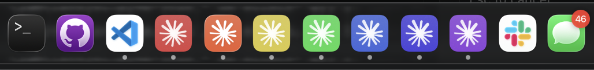

# claudes

Run multiple Claude Desktop accounts side by side on macOS, each with its own colored Dock icon.



## Why

If you have a work Claude account and a personal one, macOS only lets you run one Claude Desktop session at a time. `claudes` makes copies of your local Claude Desktop install, each pointed at its own profile directory and given its own color-coded Dock icon, so you can keep, say, a red "work" instance and a blue "personal" instance open side by side and tell them apart at a glance.

## Disclaimer

For Claude accounts you legitimately hold. No Anthropic binaries are redistributed — the tool operates only on your own local install by copying and ad-hoc re-signing it. It does not share accounts or bypass usage limits.

## Install

Requirements: macOS, and the Xcode Command Line Tools (`xcode-select --install`).

```bash
git clone https://github.com/youjonathan/claudes.git
cd claudes
./install.sh
```

`install.sh` symlinks `bin/claudes` onto your `PATH` (`/usr/local/bin` or `~/.local/bin`).

## Usage

```
claudes add <LETTER> <COLOR> [PROFILE]   create/replace a colored instance
claudes list                             show configured instances + status
claudes rebuild [--all | <LETTER>]       rebuild after a Claude update
claudes remove <LETTER> [--purge]        delete instance (keeps profile unless --purge)
claudes rainbow                          create R,O,Y,G,B,I,V instances
claudes doctor                           check environment
```

Examples:

```bash
# Create a red instance called "Claude W" backed by its own profile
claudes add W red Claude-Acct-Work

# See what's configured, and whether each instance is currently running
claudes list

# Rebuild every instance (e.g. after Claude Desktop auto-updates)
claudes rebuild --all

# Remove an instance, keeping its profile data around
claudes remove W

# Spin up seven color-coded instances at once (R, O, Y, G, B, I, V)
claudes rainbow

# Check that required tools and the main Claude.app are present
claudes doctor
```

Colors: `red orange yellow green teal blue indigo violet purple pink`, or a raw hue value `0-255`.

## Updating

When the main Claude Desktop app updates itself, your colored copies don't update automatically — rebuild them from the refreshed original:

```bash
claudes rebuild --all
```

## How it works

Each instance is built from your existing `/Applications/Claude.app`:

1. **Copy** the app bundle to `/Applications/Claude <LETTER>.app`.
2. **Re-identify** it — new `CFBundleIdentifier` and display name, so macOS treats it as a distinct app.
3. **Isolate data** by shimming the executable to launch with its own `--user-data-dir`, so each instance keeps a separate login/session.
4. **Recolor** the app icon to the requested hue.
5. **Re-sign ad-hoc**, inside-out (frameworks and libraries first, then the app bundle), including an entitlement that disables library validation, so the modified, unsigned copy still launches.
6. **Set a custom Finder icon** so the colored icon shows correctly in the Dock and Finder.

Honest note: step 5 disables library validation on the local copy so the re-signed binary can load its (unmodified, unsigned-by-us) frameworks. Native multi-account support in Claude Desktop would remove the need for any of this.

## License

MIT — see [LICENSE](LICENSE).
